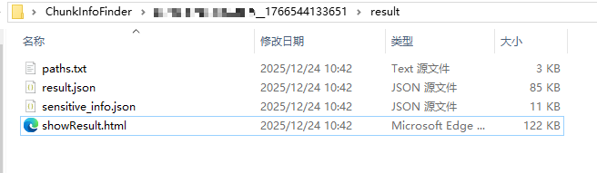
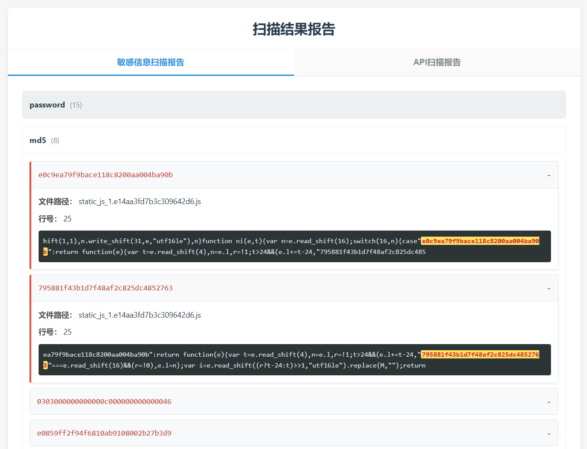
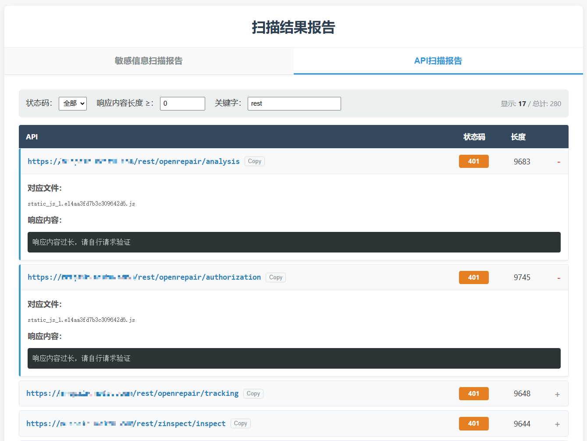

# ChunkInfoFinder

基于正则提取前端分块打包(webpack、vite等)的js文件和文件中的API、敏感信息，在下载js文件时会自动解析并下载sourcemap文件并提取对应的源代码然后扫描，提取API之前使用了Babel进行了AST分析并动态执行了JS的字符串拼接使得提取的API在缺少base-url配置时更准确。
## 运行
```plain
Usage: ChunkInfoFinder [options]

CLI to collect api in js files

Options:
  -v, --version                  输出当前版本信息
  -u, --url <url>                输入目标url
  -b, --base-url <path>          设置接口根路径
  -l, --limit-count <number>     设置并发数量 (default: "5")
  -c, --cookies <cookie-string>  设置cookies
  -H, --header <values...>       配置Header
  -d, --dir <dirPath>            用于传入需要扫描的js文件夹路径
  -D, --do-not-verify            标记不验证API
  -h, --help                     display help for command
```

## 扫描结果
报告使用HTML生成：  
扫描后会自动根据域名创建工作目录和相关文件，打开**showResult.html**可以直接查看扫描报告。  




## 功能性说明

### 敏感信息扫描
- md5：可能存在部分密码是md5 hash，扫描的结果需要自行判断
- ak/sk：云资产利用
- 内网IP
- 手机号
- 密码
- 邮箱

### API扫描
1. 部分网站接口可能存在base-url，因此配置了参数--base-url，用户需要自行分析接口的结构后自行传入参数
2. js扫描针对js文件内容和html正文中的js标签内容
3. 默认内置规则对部分与接口无关的字符进行了过滤，后续视情况还需要继续更新规则
4. 默认对于带有**delete**和**remove**关键字的接口不进行验证
5. 默认只用**GET**请求对接口进行验证
6. 对于部分请求响应可能与给定的URL响应内容一致的情况使用了SIMHASH进行相似度比较，相似程度高的判定为非接口，可自行在扫描报告中筛选。

> 注：API path扫描时针对前端路由`path: "/xxx"`这样的格式进行了过滤，尽力避免路由被标记为API path，

## 注意事项
在html的扫描报告中，敏感信息和API path都给出了对应的js文件，这主要是为了方便排查误报，然后API path有的也缺少请求参数，通过保留js文件可以方便回溯。
如果你本机已经安装了node>=20的环境，可以直接下载dist文件夹运行node index.js即可。

## 关于打包可执行文件的说明
默认github action 使用pkg打包dist/index.js，也可以自行使用[bun](https://bun.net.cn/docs/bundler/executables)打包，打包后运行时需要配置文件blacklist.json和show.html。
```bash
bun build --compile --target=bun-windows-x64 index.js --outfile ChunkInfoFinder
```

## 待更新
- 配置代理
- 正则提取加解密的密钥（JSEncrypt)?

## 一些其他的想法
目前AI向的工具层出不穷，针对JS的API path的工具也有很多，但是分析js文件本身就会消耗比较多的token，考虑到有些测试环境可能还没法调用AI，因此编写了该工具。为了后续方便mcp的调用，工具在扫描结果中放置了以下两个文件：
- path.txt：存放API path的扫描结果
- result.json：存放敏感信息的扫描结果


## 致谢
感谢以下项目的开源，本项目代码逻辑和部分正则参考了以下项目：
- https://github.com/0x727/ChkApi_0x727
- https://github.com/gh0stkey/HaE/
- https://github.com/TFour123/Packer-InfoFinder/
